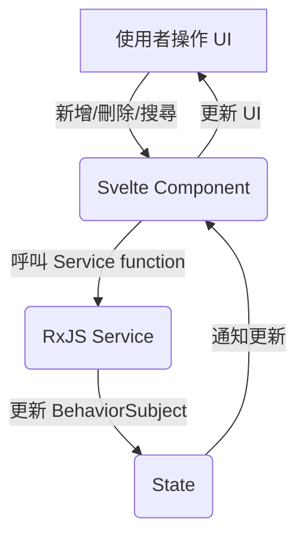
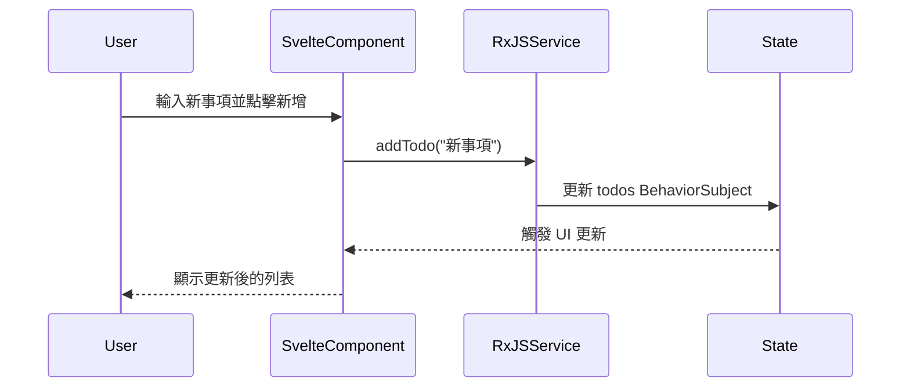

# Todolist 功能規格

## 1. 功能需求

- **列表 (List)**: 顯示所有待辦事項。
- **新增 (Create)**: 允許使用者新增待辦事項。
- **刪除 (Delete)**: 允許使用者刪除指定的待辦事項。
- **切換狀態 (Toggle)**: 允許使用者將待辦事項標示為「已完成」或「未完成」。
- **搜尋 (Search)**: 允許使用者根據關鍵字篩選待辦事項。
- **統計 (Stats)**: 顯示已完成與未完成的項目數量。

## 2. 系統架構

### 2.1 資料流程圖 (Data Flow Diagram)



### 2.2 循序圖 (Sequence Diagram)



## 3. 資料結構 (Data Structure)

```typescript
// src/lib/services/todo.service.ts

type Todo = {
  id: number;
  text: string;
  completed: boolean;
};

type TodoState = {
  todos: Todo[];
  searchTerm: string;
};
```

## 4. 核心模組

- **`src/pages/todolist.astro`**: Todolist 頁面的路由與佈局。
- **`src/lib/services/todo.service.ts`**: 使用 RxJS `BehaviorSubject` 管理 Todolist 的狀態，包含 `addTodo`, `deleteTodo`, `toggleTodo`, `searchTodos` 等函式。
- **`src/lib/components/todolist.svelte`**: Svelte 元件，負責 UI 互動、狀態顯示與統計數字的計算與呈現。